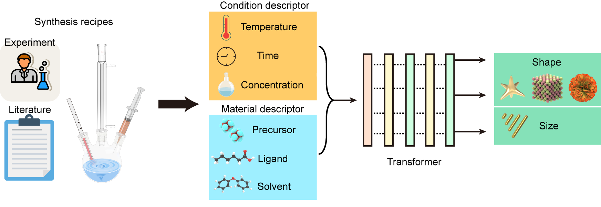
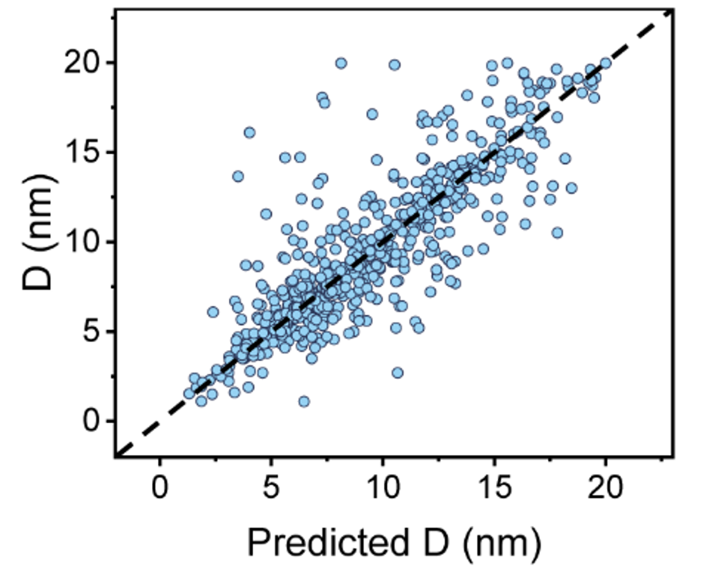

# <p>  <b> Controllable Nanocrystal Synthesis with Deep Learning Models </b> </p>

[Paper]() | [Dataset]()

The unprocessed raw dataset is available at https://github.com/Sharpiless/Nanocrystals-Deep-Learning/blob/main/Source%20data/Raw%20recipe%20dataset.xlsx

## Abstract 



The synthesis model based on transformer structure for nanocrystals takes the synthesis conditions and material structure features from the synthesis recipe dataset as input. By utilizing the proposed reaction intermediate-based data augmentation, the input data was expanded **tenfold**. This resulted in the model achieving an average absolute error of **1.39 nm** in predicting nanocrystal size, and the average accuracy for predicting morphology reached **90%**.

We show the transformer model in the following:


## Installation
```
conda create -n qml python=3.8
conda activate qml
```

here we use pytorch 1.12.0 and CUDA 11.3. Other versions of pytorch and CUDA may also be feasible, but the accuracy may be inconsistent due to different random seeds.

### install pytorch
```
pip install torch==1.12.0+cu113 torchvision==0.13.0+cu113 --extra-index-url https://download.pytorch.org/whl/cu113

```

### install other libs
```
pip install -r requirements.txt
```

### Download Dataset

Dataset for training and evaluation will be released.

Here is one example recipe of our data:
| ID | Temperature1 | Temperature2 | Speed | Time | Num  | Y1   | Y2   | Y3 | T1 | T2  | A1 | B1 | C1     | D1    | E1    | F1    | G1 | H1 | I1 | J1 | K1 | L1 | M1 | A2  | B2 | C2  | D2  | E2 | F2 | G2 | H2 | I2 | J2 | K2 | L2 | M2         |
|----|--------------|--------------|-------|------|------|------|------|----|----|-----|----|----|--------|-------|-------|-------|----|----|----|----|----|----|----|-----|----|-----|-----|----|----|----|----|----|----|----|----|-----------|
| 1  | 140          | 140          | 0     | 5    | 1195 | 4.87 | 6.49 | 9  | 1  | PbSe| 5  | 5  | 46.875 | 5.015 | 5.605 | 22.214| 0  | 0  | 0  | 0  | 0  | 0  | 0  | PbO | Se | ODE | OLA | TOP| OA | PlaceHolder | PlaceHolder | PlaceHolder | PlaceHolder | PlaceHolder | PlaceHolder | PlaceHolder |

## Performance & Results

We show size-prediction results of the validation set in all 5 folds (0~20 nm):

| Metrics | Transformer | Transformer | Decision Tree | Random Forest | DNN | LSTM |
|---------|-------------|-------------|-------------|-------------|-------------|------------------------|
|         | Train from scratch | Pretrain-finetune |               |               |                             |                        |
| MAE (nm) | 1.4449 | **1.3995** | 2.0495 | 1.6307 | 3.3697 | 1.5570 |
| MSE (nm²) | 5.2604 | **5.0256** | 10.2676 | 5.6185 | 22.3104 | 5.9962 |
| RMSE (nm) | 2.2859 | **2.2397** | 3.1881 | 2.3599 | 4.7151 | 2.4461 |
| MAPE (a.u.) | 0.1820 | **0.1706** | 0.2598 | 0.2137 | 0.4178 | 0.1930 |
| R² (a.u.) | 0.7067 | **0.7198** | 0.4289 | 0.6896 | -0.2546 | 0.6629 |



We also show the shape-prediction and t-SNE results of these data (89.3% average accuracy on 5-fold validation set):


To reproduce our results on size prediction, run:
```
bash scripts/best_size.sh
```

Or download our pre-traiend checkpoints and training logs from: [https://github.com/Sharpiless/Nanocrystals-Deep-Learning/releases/tag/checkpoints](https://github.com/Sharpiless/Nanocrystals-Deep-Learning/releases/tag/checkpoints)

You will get the same results in log.txt:
```
2024-04-03 15:28:47,001 [INFO]: - eval - mse: 5.0256
2024-04-03 15:28:47,001 [INFO]: - eval - rmse: 2.2397
2024-04-03 15:28:47,001 [INFO]: - eval - mape: 0.1706
2024-04-03 15:28:47,002 [INFO]: - eval - mae: 1.3995
2024-04-03 15:28:47,002 [INFO]: - eval - r2: 0.7198
```

To reproduce our results on shape prediction, run:
```
bash scripts/best_cls.sh
```

You will get the same results in log.txt:
```
2024-04-19 18:18:50,791 [INFO]: - eval - accuracy: 0.8930
2024-04-19 18:18:50,791 [INFO]: - eval - f1: 0.8900
2024-04-19 18:18:50,791 [INFO]: - eval - recall: 0.8930
2024-04-19 18:18:50,791 [INFO]: - eval - precision: 0.8964
```

We also support size prediction of unknow/unseen products, by treating one products as validation set and the others as training set. We show size-prediction results of 4 products which are not seen in the training data (0~20 nm):

| Test dataset | | MAPE (a.u.) | | | MAE (nm) | | | R² (a.u.) | |
|--------------|-------------|-------------|-------------|-------------|-------------|-------------|-------------|-------------|-------------|
|              | Random forest | Transformer (Train from scratch) | Transformer (Pretrain-finetune) | Random forest | Transformer (Train from scratch) | Transformer (Pretrain-finetune) | Random forest | Transformer (Train from scratch) | Transformer (Pretrain-finetune) |
| PbSe         | 0.3974 | 0.3147 | **0.2643** | 3.4976 | 3.4941 | **2.6522** | -6.4040 | -0.1443 | **0.3853** |
| Ag2S         | 0.4466 | 0.6934 | **0.6512** | 3.4927 | 3.4786 | **3.1903** | -2.5640 | 0.1936 | **0.4056** |
| Ni           | 0.2922 | 0.3528 | **0.3536** | 2.4626 | 2.5411 | **2.0056** | -3.2779 | 0.2022 | **0.4200** |
| Cs₂NaBiCl₆   | 0.3622 | 0.1581 | **0.1130** | 2.9368 | 2.0923 | **1.4805** | -0.4251 | 0.3742 | **0.6910** |

To reproduce our results on size prediction of unknow/unseen products, run:
```
bash scripts/best_new.sh
```

You can change "--object_name XXXX" to set the name of unknow/unseen products.

## Prepare you own dataset

The synthetic recipe dataset contains **3,448** recipes, which is an order of magnitude more than those reported in the literature.  The involved nanocrystals nearly cover the entire periodic table, including **562** synthetic recipes for elements, **1,961** for binary compounds, and also **382** different types of precursors. Deep learning requires larger datasets, therefore, we propose a reaction intermediate-based data augmentation method, utilizing DFT calculations of the reaction intermediate structures as new descriptors, achieving a tenfold expansion of the data. Here is the frequency distribution of elements in different nanocrystals within the dataset:


[To Do]

Data shoud be save in a ".csv" file, where "X1" indicates the amount of substance (mmol) and "X2" indicates the name of substance. Note that "T*" indicate the product, while the others indicate reactants. "Temperature1" indicates injection temperature and "Temperature2" indicates reaction temperature. "Speed" indicates rate of temperature increase (℃/min) and "Time" indicates reaction time. "Num" indicates the statistics number of nanocrystals.

| ID | Temperature1 | Temperature2 | Speed | Time | Num  | Y1   | Y2   | Y3 | T1 | T2  | A1 | B1 | C1     | D1    | E1    | F1    | G1 | H1 | I1 | J1 | K1 | L1 | M1 | A2  | B2 | C2  | D2  | E2 | F2 | G2 | H2 | I2 | J2 | K2 | L2 | M2         |
|----|--------------|--------------|-------|------|------|------|------|----|----|-----|----|----|--------|-------|-------|-------|----|----|----|----|----|----|----|-----|----|-----|-----|----|----|----|----|----|----|----|----|-----------|
| 1  | 140          | 140          | 0     | 5    | 1195 | 4.87 | 6.49 | 9  | 1  | PbSe| 5  | 5  | 46.875 | 5.015 | 5.605 | 22.214| 0  | 0  | 0  | 0  | 0  | 0  | 0  | PbO | Se | ODE | OLA | TOP| OA | PlaceHolder | PlaceHolder | PlaceHolder | PlaceHolder | PlaceHolder | PlaceHolder | PlaceHolder |

## Reaction intermediate-based data augmentation

To overcome the challenge of limited training data, we propose for the first time a data augmentation method based on reaction intermediates:


This method increases the amount and diversity of data for model training. The main principle involves letting any two substances in a reaction, such as PbO and OA (PbO.cif and OA.cif), undergo a chemical reaction (assuming a molar ratio of 1:1) to form an intermediate substance PbO-OA (PbO@OA.cif). We obtain its 3Dl structure through structural optimization calculations, then input it into a graph neural network to obtain descriptors. Finally, we update the molar amounts of PbO and OA as well as the molar amount and descriptors of PbO-OA, thus generating a new reaction dataset.

## Extract substance descriptors

We use Uni-Mol to extract substance descriptors. We show one ".pkl" file of extracted descriptors in ["feats/unioml_feats_20240309_1x_ours_1x_mof.pkl"](feats\unioml_feats_20240309_1x_ours_1x_mof.pkl).

If you want to finetune Uni-Mol and extract your own data, please refer to [Uni-Mol](Uni-Mol/README.md). Notice this codebase relies on my own customized Uni-Mol, which provides more functionalities than the official one.

To augment your own data, first extract the descriptors of substances and intermediate substances, and save the features into a ".pkl" file.

Then, run:
```
bash scripts/aug.sh
```

Note that you need to modify the ".pkl" path in "--feats".

## License and Citation
This repository can only be used for personal/research/non-commercial purposes. Please cite the following paper if this model helps your research:

```
@inproceedings{DLMCNS2024,
    author = {Kai Gu, Yingping Liang, Jiaming Su, Peihan Sun, Jia Peng, Naihua Miao, Zhimei Sun, Ying Fu, Haizheng Zhong, Jun Zhang},
    title = {Deep Learning Models for Colloidal Nanocrystal Synthesis},
    booktitle = {https://doi.org/10.48550/arXiv.2412.10838},
    year={2024}
}
```

## Contact
If you find any problem, please feel free to contact me (liangyingping@bit.edu.cn).
